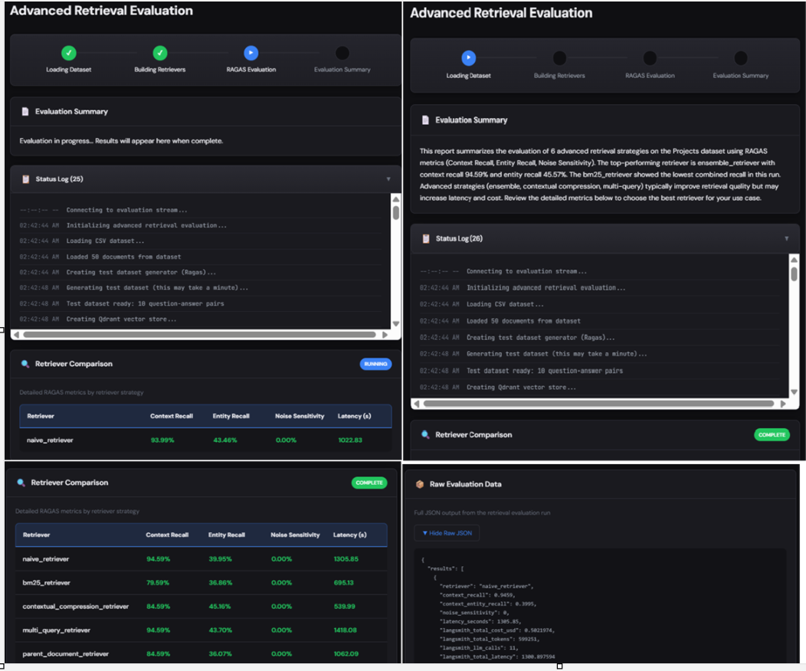

# Advanced Retrieval Evaluation

A web-based UI for evaluating multiple RAG retrieval strategies using **RAGAS** (Retrieval Augmented Generation Assessment) metrics. Compare naive, BM25, contextual compression, multi-query, parent document, and ensemble retrievers side-by-side with real-time execution logs and an evaluation summary.

---

## 📸 Execution Screenshot




---

## 🛠 Tech Stack

| Layer | Technology |
|-------|------------|
| **Backend** | FastAPI, Uvicorn, Python 3.13 |
| **Frontend** | Vanilla HTML/CSS/JS (no framework) |
| **RAG / LLM** | LangChain, LangChain OpenAI, LangChain Cohere |
| **Vector Store** | Qdrant (in-memory) |
| **Evaluation** | RAGAS 0.3.6 |
| **Retrieval** | BM25 (rank-bm25), Qdrant, Cohere Rerank |
| **Data** | Pandas, CSV |

---

## 🏗 High-Level Architecture

```
┌─────────────────────────────────────────────────────────────────────────┐
│                         Frontend (Browser)                               │
│  ┌──────────────┐  ┌──────────────────┐  ┌──────────────────────────┐   │
│  │ Workflow     │  │ Evaluation       │  │ Retriever Comparison     │   │
│  │ Tracker      │  │ Summary          │  │ (Context Recall, etc.)   │   │
│  └──────────────┘  └──────────────────┘  └──────────────────────────┘   │
│  ┌──────────────────────────┐  ┌──────────────────────────────────────┐ │
│  │ Status Log (SSE stream)   │  │ Raw Evaluation Data (JSON)           │ │
│  └──────────────────────────┘  └──────────────────────────────────────┘ │
└─────────────────────────────────────────────────────────────────────────┘
                                    │
                                    │ HTTP / SSE
                                    ▼
┌─────────────────────────────────────────────────────────────────────────┐
│                    FastAPI Backend (api/main.py)                         │
│  /api/run/stream  │  /api/results  │  /api/executive-summary             │
└─────────────────────────────────────────────────────────────────────────┘
                                    │
                                    │ Subprocess (avoids asyncio conflicts)
                                    ▼
┌─────────────────────────────────────────────────────────────────────────┐
│              Evaluation Runner (api/evaluation_runner.py)                │
│  - Load dataset (Projects_with_Domains.csv)                              │
│  - Generate test dataset (RAGAS TestsetGenerator)                        │
│  - Build 6 retriever chains                                              │
│  - Evaluate each with RAGAS                                              │
│  - Save results to CSV                                                   │
└─────────────────────────────────────────────────────────────────────────┘
                                    │
                                    ▼
┌─────────────────────────────────────────────────────────────────────────┐
│              evaluate_retrievers.py + RAGAS + LangChain                  │
│  Naive │ BM25 │ Contextual Compression │ Multi-Query │ Parent Doc │ Ensemble │
└─────────────────────────────────────────────────────────────────────────┘
```

---

## ✨ Key Features

- **6 Retrieval Strategies Evaluated:**
  - Naive (vector similarity)
  - BM25 (sparse / keyword)
  - Contextual compression (Cohere rerank)
  - Multi-query
  - Parent document
  - Ensemble (equal-weighted combination)

- **RAGAS Metrics:**
  - Context Recall
  - Context Entity Recall
  - Noise Sensitivity
  - Latency (per retriever)

- **UI:**
  - Workflow tracker (Loading → Building → Evaluating → Summary)
  - Live execution log via Server-Sent Events (SSE)
  - Evaluation summary (refreshes on Run or Load Previous Results)
  - Retriever comparison table
  - Raw JSON for inspection

- **Results:** Auto-load from `data/` or `temporary/` on page load; manual "Load Previous Results" available.

---

## 🚀 Quick Start

### 1. Install Dependencies

```bash
cd 09_Advanced_Retrieval
uv sync
# or: pip install -e .
```

### 2. Configure API Keys

Edit `config.py` and set your keys:

- `OPENAI_API_KEY` (required)
- `COHERE_API_KEY` (required for contextual compression rerank)
- `LANGCHAIN_API_KEY` (optional, for LangSmith tracing)

### 3. Run the UI

```bash
python run_ui.py
```

Then open **http://localhost:8001** in your browser.

---

## 📁 Project Structure

```
09_Advanced_Retrieval/
├── api/
│   ├── main.py              # FastAPI app, SSE streaming, static serving
│   └── evaluation_runner.py # Wraps evaluate_retrievers with log streaming
├── frontend/
│   ├── index.html           # Main UI
│   └── assets/
│       ├── style.css        # Styles
│       └── app.js           # Client logic (SSE, tables, summary)
├── data/
│   ├── Projects_with_Domains.csv           # Input dataset
│   └── retriever_evaluation_results.csv    # Output (after run)
├── temporary/               # Optional alternate results path
├── config.py                # API keys (edit here only)
├── run_ui.py                # Entry point (port 8001)
├── evaluate_retrievers.py   # Core retriever + RAGAS logic
├── dataset_persistence.py   # Dataset caching
├── testset_persistence.py   # Test dataset caching
├── pyproject.toml           # Dependencies
└── README.md                # This file
```

---

## 🔑 API Endpoints

| Endpoint | Method | Description |
|----------|--------|-------------|
| `/` | GET | Serves the UI |
| `/api/health` | GET | Health check |
| `/api/run/stream` | GET | Run evaluation, stream logs + retriever results via SSE |
| `/api/results` | GET | Get saved evaluation results (CSV → JSON) |
| `/api/executive-summary` | GET | Get executive summary from saved results |
| `/api/status` | GET | Check if evaluation is running |

---

## 📊 Sample Output

| Retriever | Context Recall | Entity Recall | Noise Sensitivity | Latency (s) |
|-----------|----------------|---------------|-------------------|-------------|
| naive_retriever | 94.59% | 39.95% | 0% | 1305.85 |
| bm25_retriever | 79.59% | 36.86% | 0% | 695.13 |
| contextual_compression_retriever | 84.59% | 45.16% | 0% | 539.99 |
| multi_query_retriever | 94.59% | 43.70% | 0% | 1418.08 |
| parent_document_retriever | 84.59% | 36.07% | 0% | 1062.09 |
| ensemble_retriever | 94.59% | 45.57% | 0% | 2022.09 |

---

## 📝 Notes

- **Evaluation runs in a subprocess** to avoid asyncio conflicts when stopping the server (Ragas uses async internally).
- Results are read from `data/` first, then `temporary/` if no `data/` file exists.
- LangSmith tracing is optional; cost/token stats appear when configured.

---


